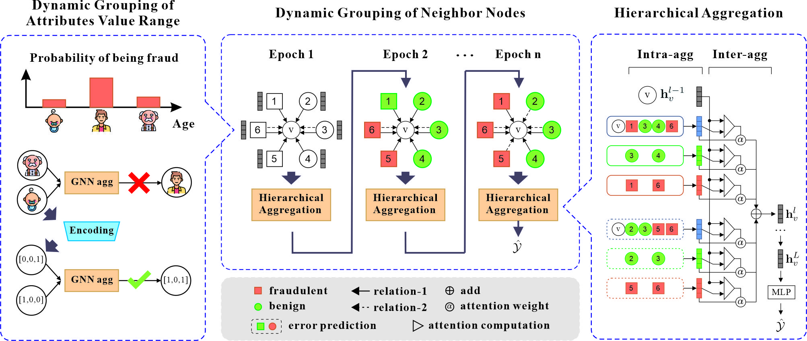

# DGA-GNN: Dynamic Grouping Aggregation GNN for Fraud Detection

###  Abstract

Fraud detection has increasingly become a prominent research field due to the dramatically increased incidents of fraud. The complex connections involving thousands, or even millions of nodes, present challenges for fraud detection tasks. Many researchers have developed various graph-based methods to detect fraud from these intricate graphs. However, those methods neglect two distinct characteristics of the fraud graph: the non-additivity of certain attributes and the distinguishability of grouped messages from neighbor nodes.
This paper introduces the Dynamic Grouping Aggregation Graph neural network (DGA-GNN) for fraud detection, which addresses these two characteristics by dynamically grouping attribute value ranges and neighbor nodes. In DGA-GNN, we initially propose the decision tree binning encoding to transform non-additive node attributes into bin vectors. This approach aligns well with the GNN’s aggregation operation and avoids nonsensical feature generation. Furthermore, we devise a feedback dynamic grouping strategy to classify graph nodes into two distinct groups and then employ a hierarchical aggregation. This method extracts more discriminative features for fraud detection tasks. Extensive experiments on five datasets suggest that our proposed method achieves a 3%~16% improvement over existing SOTA methods.


## **Framework**

---


## **Getting Started**
### **1. Dataset Preparation:**

- Download the dataset from [this link](https://drive.google.com/file/d/1ws9J_mrkRjnWVs8_gIQ3oFvF96TWt6HS/view?usp=drive_link).
- Place the downloaded `fraud_graph_rawdata.7z` file in the `data` directory.
- Decompress the dataset by executing:
  ```bash
  7z x fraud_graph_rawdata.7z
  ```
  
### **2. Data Preprocessing:**

- Change the directory to the code folder:
  ```bash
  cd code
  ```
- Start the data preprocessing by running:
  ```bash
  python data_handle.py  
  ```

### **3. Training Models:**

- run <code> python train.py --config-name elliptic_of_amnet</code>  for Elliptic dataset  
- run <code> python train.py --config-name tfinancet</code>  for T-Finance dataset  
- run <code> python train.py --config-name tsocialt</code>  for T-Social dataset  
- run <code> python train.py --config-name yelpchit</code>  for YelpChi dataset   
- run <code> python train.py --config-name amazont</code>  for Amazon dataset    

If you are familiar with wandb, you can set nowandb==False in the config.

###  **Mainly Dependencies:**
- torch==1.13.1   
- dgl==1.1.2  
- toad==0.1.1  
- pandas==1.3.5  
- numpy==1.21.5  
- scikit-learn==1.0.2  
- pytorch-lightning==1.9.4  
- wandb==0.13.10  
- hydra-core==1.3.2 
 
